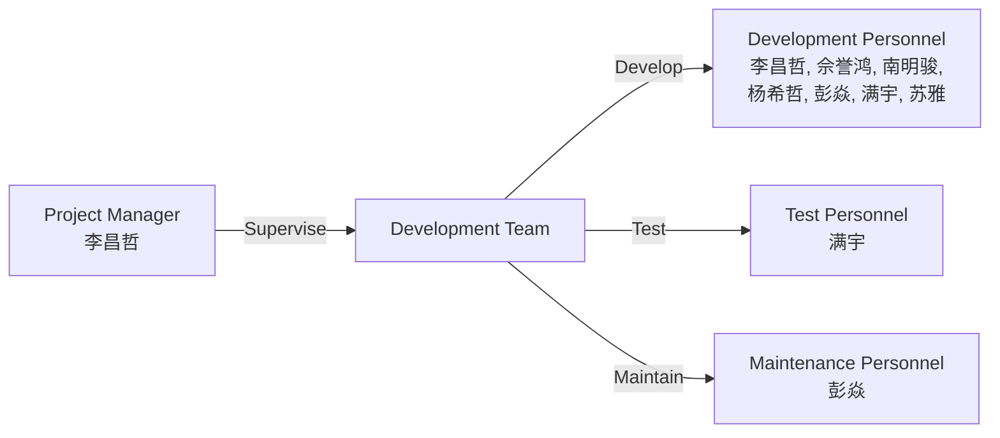

# Project Implementation Plan of UAV Toolkit

## Catalog

1. [Project Background](#project-background)
2. [Project Objectives](#project-objectives)
3. [Project Overall Plan](#project-overall-plan)
4. [Project Team Organization](#project-team-organization)
    1. [Personnel Division](#personnel-division)
5. [Project Risks and Key Issues](#project-risks-and-key-issues)
    1. [Risk Analysis](#risk-analysis)
    2. [Key Phases](#key-phases)
6. [Project Management Specification](#project-management-specification)
    1. [Project Implementation Constraints](#project-implementation-constraints)
    2. [Project Change and Freeze](#project-change-and-freeze)
    3. [Project Communication](#project-communication)

## Project Background

With the development of UAV technology, UAV remote sensing technology has been widely used in various fields.
So far, there are many software tools that can be used to process remote sensing data,
but most of them are not specifically designed for UAV remote sensing data processing.
Therefore, the development of a toolkit specifically for UAV remote sensing data processing is necessary.

## Project Objectives

The main objectives of the project are as follows:

1. To develop a tool that can be used to process UAV remote sensing data.
2. To provide a series of functions or develop a tool to help users process UAV remote sensing data more efficiently.
3. To provide a series of functions or develop a tool to help users visualize UAV remote sensing data in 3D.
4. To provide a series of functions or develop a tool to help users detect targets and output the objectification of the
   grid based on the 3D scene of ArcGIS Pro.
5. To develop a tool that can be used to check the accuracy of image matching based on ArcGisPro.
6. To develop a tool that can be used to optimize the deep learning processing of UAV remote sensing images based on
   ArcGls Pro.
7. To integrate the above functions into one or more toolkits (`*.tbx`) and provide a user-friendly interface with the
   user documentations as the final product.

## Project Overall Plan

[//]: # (TODO 负责人需要根据实际情况更改)

|                   Phase                   | Start Time |  End Time  |                                                                       Work Content                                                                        |                                                                        Phase Goal                                                                        | Person in Charge |
|:-----------------------------------------:|:----------:|:----------:|:---------------------------------------------------------------------------------------------------------------------------------------------------------:|:--------------------------------------------------------------------------------------------------------------------------------------------------------:|:----------------:|
| 01 Planning Stage \& Requirement Analysis | 2024-03-19 | 2024-03-22 | 1. Feasibility Analysis 2. Project Information Sheet 3. Project Implementation Plan 4. Project Implementation Schedule 5. User Requirements Specification | To complete the planning stage and requirement analysis of the project, and to provide a basis for the subsequent design and development of the project. |       ALL        |
|         02 Schematic Design Stage         | 2024-03-23 | 2024-03-27 |                                                            1. Functional Design Specification                                                             |                                                  To complete the schematic design stage of the project.                                                  |     李昌哲, 佘誉鸿     |
|         03 Detailed Design Stage          |    ???     |    ???     |                                                             1. Detailed Design Specification                                                              |                                                  To complete the detailed design stage of the project.                                                   |       ALL        |
|  04 Development and Implementation Stage  |    ???     |    ???     |                                                             1. Development and Implementation                                                             |                                           To complete the development and implementation stage of the project.                                           |       ALL        |
|             05 Testing Stage              |    ???     |    ???     |                                                                        1. Testing                                                                         |                                                      To complete the testing stage of the project.                                                       |        满宇        |
|           06 Maintenance Stage            |    ???     |    ???     |                                                                      1. Maintenance                                                                       |                                                    To complete the maintenance stage of the project.                                                     |        彭焱        |

## Project Team Organization

### Personnel Division

|       Position        |                                                                Work Content                                                                |
|:---------------------:|:------------------------------------------------------------------------------------------------------------------------------------------:|
|    Project Manager    | 1. Supervise the development team. 2. Coordinate the work of the development team. 3. Responsible for the overall progress of the project. |
| Development Personnel |                  1. Responsible for the development of the project. 2. Responsible for the implementation of the project.                  |
|    Test Personnel     |                                               1. Responsible for the testing of the project.                                               |
| Maintenance Personnel |                                             1. Responsible for the maintenance of the project.                                             |

## Project Risks and Key Issues

### Risk Analysis

|                                                Risk Description                                                |               Risk Impact               |                                                                                                                     Response Measures                                                                                                                      |
|:--------------------------------------------------------------------------------------------------------------:|:---------------------------------------:|:----------------------------------------------------------------------------------------------------------------------------------------------------------------------------------------------------------------------------------------------------------:|
|                                        Frequent changes in requirements                                        | The project cannot be completed on time |           1. The project manager should communicate with the customer in time to understand the customer's requirements. 2. The project manager should communicate with the development team in time to understand the customer's requirements.            |
| Some of the modules developed by various personnel interact with each other, and the interaction is not smooth | The project cannot be completed on time | 1. Regularly communicate with the development team to understand the progress of the project. 2. Regularly communicate with the development team to understand the progress of the project. 2. Adjust the final product according to the actual situation. |

### Key Phases

|               Key Phase                |                                                                           Task                                                                            |
|:--------------------------------------:|:---------------------------------------------------------------------------------------------------------------------------------------------------------:|
| Planning Stage \& Requirement Analysis | 1. Feasibility Analysis 2. Project Information Sheet 3. Project Implementation Plan 4. Project Implementation Schedule 5. User Requirements Specification |
|       Architectural Design Stage       |                                                            1. Functional Design Specification                                                             |
|  Development and Implementation Stage  |                                                             1. Development and Implementation                                                             |
|             Testing Stage              |                                                                 1. Testing 2. Bug Fixing                                                                  |
|        User Documentation Stage        |                                                                1. Write User Documentation                                                                |
|     Release and Maintenance Stage      |                                           1. Release Product 2. Write Maintenance Documentation 3. Open Source                                            |

## Project Management Specification

### Project Implementation Constraints

1. The toolkit is developed based on Python3, and it should support ArcGIS Pro 3.0 and above versions.
2. The toolkit should be developed based on the ArcGIS Pro Python reference.

### Project Change and Freeze

Only the **development** phase and the **testing** phase can be changed.
The final maintenance phase **CANNOT** be extended.

### Project Communication

1. Offline communication: At least one meeting every week.
2. Online communication:
    1. Discuss some simple issues in the WeChat workgroup.
    2. Documenting and resolving critical issues and work tasks on GitHub Issues using published Issues and Milestones.