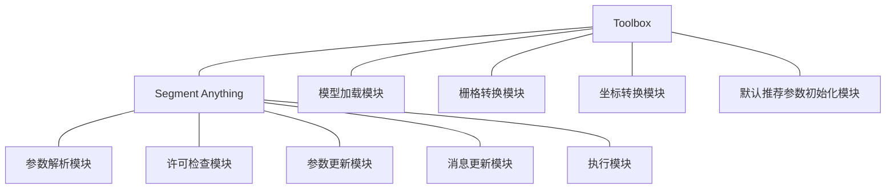

# 设计文档

## 总体设计

### 系统架构

UAV Toolkit项目主要由两个主要组件构成：`Toolbox`类和`SegmentAnything`类。

`Toolbox`类是项目的主要入口点，调用用来管理内部的工具。还有一些通用的方法，比如加载模型、将栅格转换为numpy数组等，坐标转换等。

`SegmentAnything`类是一个工具，它使用Segment Anything模型（SAM）来分割无人机图像。这个类包含了一组参数，这些参数可以用于控制图像分割的过程。里面包含了一系列的模块和方法。

### 组件交互

当用户运行UAV Toolkit项目时，他们首先会创建一个`Toolbox`类的实例。然后，他们可以使用`Toolbox`类中的工具来处理无人机图像。

每个工具都是一个`SegmentAnything`类的实例。当用户使用一个工具时，他们实际上是在调用`SegmentAnything`类的方法。

### 模块结构

## 详细设计

### `Toolbox`类

`Toolbox`类是UAV Toolkit项目的主要入口点。它包含了一组工具，这些工具可以用于处理无人机图像。`Toolbox`类中的每个工具都是一个`SegmentAnything`类的实例。

`Toolbox`类有以下主要方法：

- `load_model`：这个方法用于加载Segment Anything模型（SAM）。它接受一个模型检查点文件的路径，一个模型类型，以及一个消息对象。它返回一个加载的SAM模型。

- `raster2numpy`：这个方法用于将一个栅格转换为一个numpy数组。它接受一个栅格，以及红色、绿色和蓝色通道的名称。它返回一个numpy数组。

- `extractingCoordinatesAndLabels`：这个方法用于从一个点特征类中提取像素坐标和标签。它接受一个点特征类，一个栅格，以及一个标签字段的名称。它返回一个numpy数组。

- `geoCood2pixelCood`：这个方法用于将地理坐标转换为像素坐标。它接受栅格的左上角X坐标、左上角Y坐标、栅格的分辨率、地理X坐标和地理Y坐标。它返回像素坐标。

- `image_pca`：这个方法用于对图像进行主成分分析（PCA）。它接受一个图像矩阵。它返回一个经过PCA变换的图像矩阵。

- `recommended_pred_iou_thresh`：这个方法用于推荐预测的IoU阈值。它接受一个图像矩阵和一个二值化的掩膜矩阵。它返回一个推荐的IoU阈值。

### `SegmentAnything`类

`SegmentAnything`类是一个工具，它使用Segment Anything模型（SAM）来分割无人机图像。这个类包含了一组参数，这些参数可以用于控制图像分割的过程。

`SegmentAnything`类有以下主要方法：

- `getParameterInfo`：这个方法用于获取工具的参数信息。它返回一个参数列表。

- `isLicensed`：这个方法用于检查工具是否有许可证。它返回一个布尔值。

- `updateParameters`：这个方法用于更新工具的参数。它接受一个参数列表。

- `execute`：这个方法用于执行工具。它接受一个参数列表和一个消息对象。它返回一个特征类。

- `postExecute`：这个方法在输出被处理并添加到显示后执行。它接受一个参数列表。
