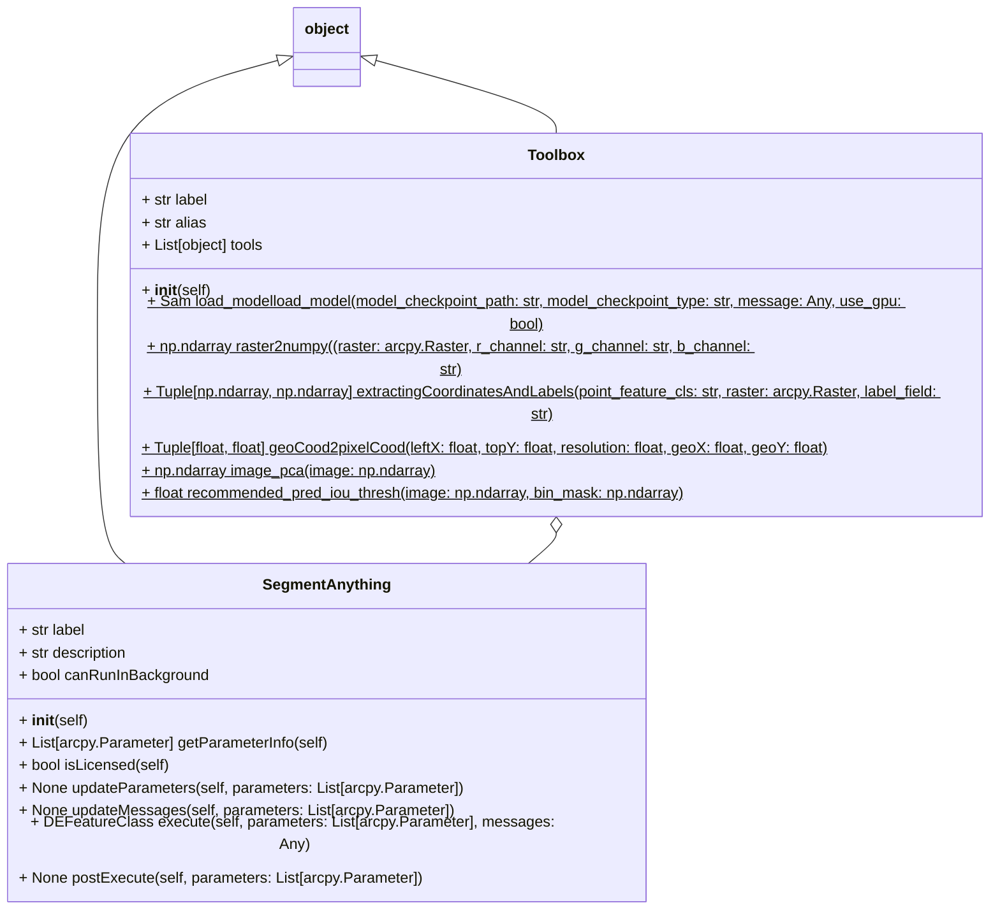
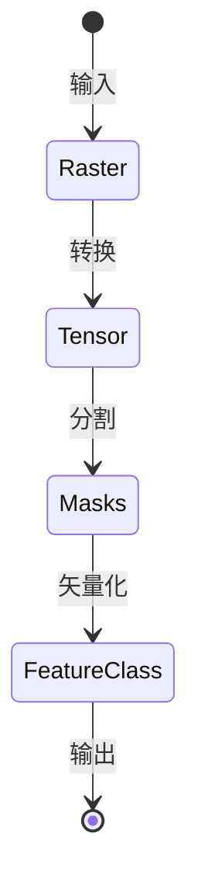
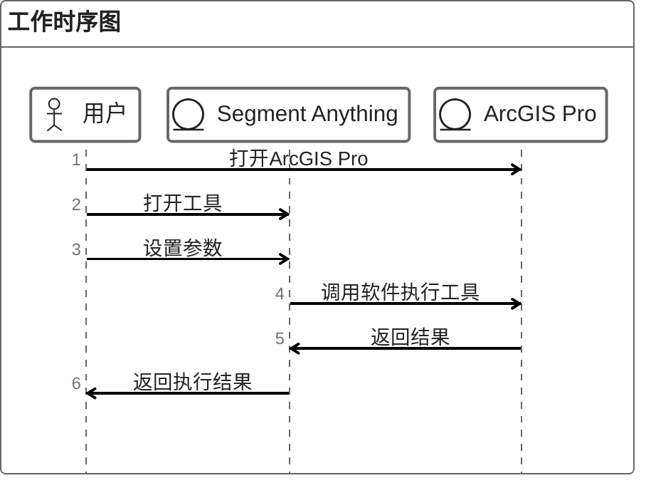
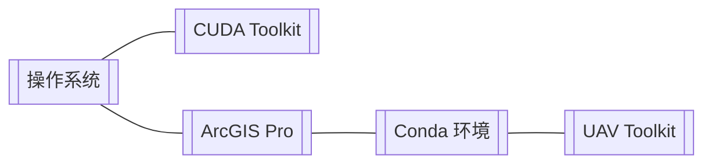

# UML图

## 类图

```mermaid
classDiagram
    object <|-- Toolbox
    object <|-- SegmentAnything
    Toolbox o-- SegmentAnything
    
    class Toolbox {
        + str label
        + str alias
        + List[object] tools
        + __init__(self)
        + Sam load_modelload_model(model_checkpoint_path: str, model_checkpoint_type: str, message: Any, use_gpu: bool)$
        + np.ndarray raster2numpy((raster: arcpy.Raster, r_channel: str, g_channel: str, b_channel: str)$
        + Tuple[np.ndarray, np.ndarray] extractingCoordinatesAndLabels(point_feature_cls: str, raster: arcpy.Raster, label_field: str)$
        + Tuple[float, float] geoCood2pixelCood(leftX: float, topY: float, resolution: float, geoX: float, geoY: float)$
        + np.ndarray image_pca(image: np.ndarray)$
        + float recommended_pred_iou_thresh(image: np.ndarray, bin_mask: np.ndarray)$
    }
    
    class SegmentAnything {
        + str label
        + str description
        + bool canRunInBackground
        + __init__(self)
        + List[arcpy.Parameter] getParameterInfo(self)
        + bool isLicensed(self)
        + None updateParameters(self, parameters: List[arcpy.Parameter])
        + None updateMessages(self, parameters: List[arcpy.Parameter])
        + DEFeatureClass execute(self, parameters: List[arcpy.Parameter], messages: Any)
        + None postExecute(self, parameters: List[arcpy.Parameter])
    }
```

## 状态图

```mermaid
stateDiagram-v2
    [*] --> Raster: 输入
    Raster --> Tensor: 转换
    Tensor --> Masks: 分割
    Masks --> FeatureClass: 矢量化
    FeatureClass --> [*]: 输出
```

## 时序图

```mermaid
zenuml
    title 工作时序图
    @actor user as "用户"
    @entity tool as "Segment Anything"
    @entity software as "ArcGIS Pro"
    user -> software: 打开ArcGIS Pro
    user -> tool: 打开工具
    user -> tool: 设置参数
    tool -> software: 调用软件执行工具
    software -> tool: 返回结果
    tool -> user: 返回执行结果
```

## 部署图

```mermaid
graph LR
    A[[操作系统]] --- B[[CUDA Toolkit]]
    A --- C[[ArcGIS Pro]] --- D[[Conda 环境]]  --- E[[UAV Toolkit]]
```