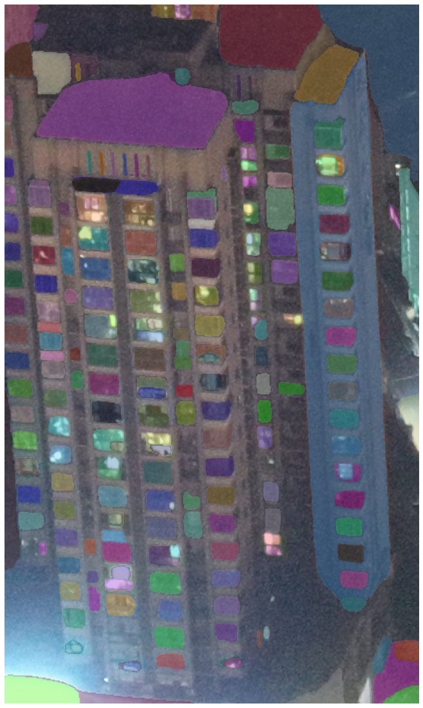
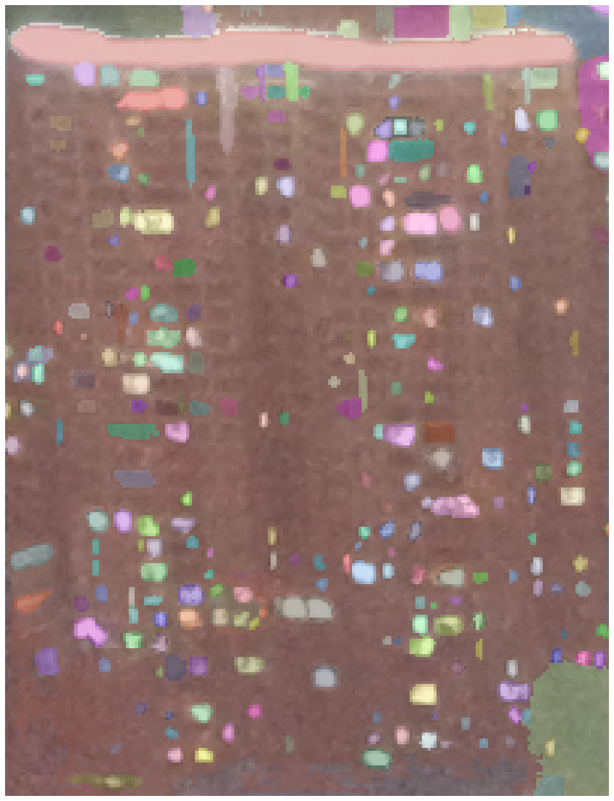
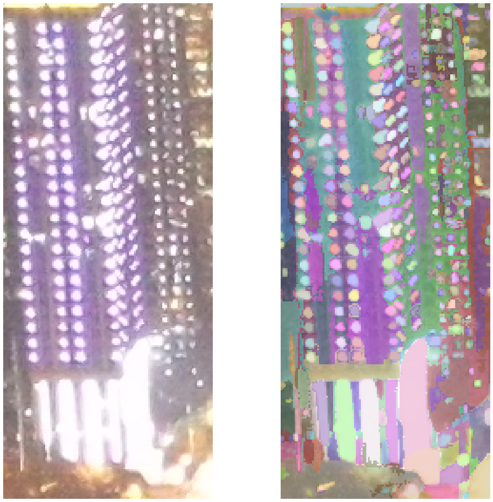
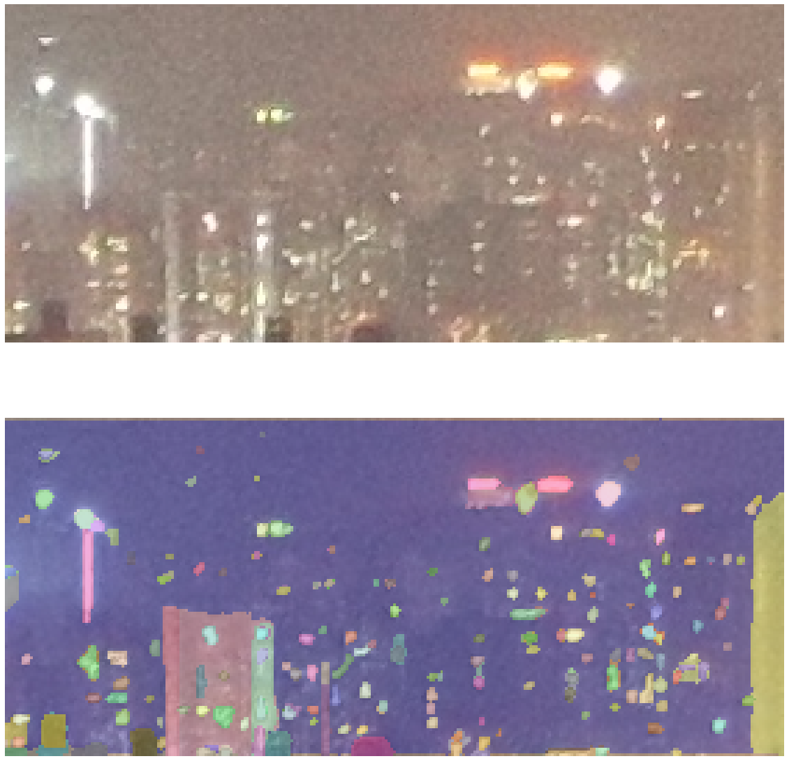
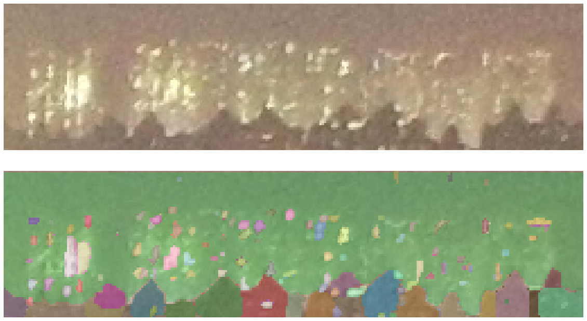

# UAV_Toolkit.SegmentAnything 调参指南

## 专家参数说明

- `points_per_side`:
    - int: [1, +inf)
    - 描述: 采样图片时，每个边的点数。一共采集`points_per_side`^2个点。

- `points_per_batch`:
    - int: [1, +inf)
    - 描述: 每个batch的点数。数值越大，分割越快，但是GPU内存占用也越大。

- `pred_iou_thresh`:
    - float: [0, 1]
    - 描述: 预测的对象交并比（Intersection over Union，IoU）阈值。数值越大，分割越快，但是分割的精度也会降低。

- `stability_score_thresh`:
    - float: [0, 1]
    - 描述: 稳定性评分阈值。数值越大，分割越快，但是分割的精度也会降低。稳定性得分是一种衡量掩膜质量的指标，它衡量的是掩膜在改变用于二值化模型的掩膜预测的截止值时的稳定性。

- `stability_score_offset`:
    - float: (-inf, +inf)
    - 描述: 稳定性评分偏移，用于计算掩膜稳定性得分时的偏移量。稳定性得分是一种衡量掩膜质量的指标，它衡量的是掩膜在改变用于二值化模型的掩膜预测的截止值时的稳定性。
      在计算稳定性得分时，会将模型的掩膜预测的截止值上下移动stability_score_offset的量，然后观察掩膜的变化。如果掩膜在截止值变化时保持稳定，那么稳定性得分就会高；反之，如果掩膜在截止值变化时发生大的变化，那么稳定性得分就会低。

- `box_nms_thresh`:
    - float: [0, 1]
    - 描述:
      在目标检测任务中，模型可能会为同一个目标生成多个边界框。NMS的作用就是保留最佳的边界框，并删除其他重叠的边界框。box_nms_thresh参数就是用来决定何时认为两个边界框是重叠的。如果两个边界框的交并比（Intersection
      over Union，IoU）大于box_nms_thresh，那么这两个边界框就被认为是重叠的，其中得分较低的边界框将被删除。

- `crop_n_layers`:
    - int: [0, +inf)
    - 描述:
      用于设置图像裁剪的层数。在进行图像分割时，可能会将图像分割成多个裁剪区域（crop），然后在每个裁剪区域上运行模型。这种方法可以帮助处理大尺寸的图像，或者在需要更详细的局部信息时使用。`crop_n_layers`
      参数决定了进行多少层的裁剪。例如，如果`crop_n_layers`
      为1，那么将进行一层裁剪，图像将被分割成多个裁剪区域；如果`crop_n_layers`
      为2，那么将进行两层裁剪，每个裁剪区域又将被进一步分割成更小的裁剪区域。默认情况`crop_n_layers=0`中，`crop_n_layers`
      被设置为0，这意味着不进行裁剪，直接在整个图像上运行模型。

- `crop_nms_thresh`:
    - float: [0, 1]
    - 描述: 这个参数用于非极大值抑制（Non-Maximum
      Suppression，NMS）过程。在进行图像分割时，可能会将图像分割成多个裁剪区域（crop），然后在每个裁剪区域上运行模型。这种方法可以帮助处理大尺寸的图像，或者在需要更详细的局部信息时使用。然而，这可能会导致同一个目标在不同的裁剪区域中被多次检测，从而生成重复的掩膜。为了解决这个问题，可以使用非极大值抑制（NMS）算法来过滤重复的掩膜。NMS算法的工作原理是，对于每一个掩膜，如果它与其他掩膜的交并比（Intersection
      over Union，IoU）超过了一个阈值，那么就将其认为是重复的，并将其删除。`crop_nms_thresh`
      参数就是用来决定何时认为两个掩膜是重复的。如果两个掩膜的IoU大于`crop_nms_thresh`，那么这两个掩膜就被认为是重复的，其中得分较低的掩膜将被删除。

- `crop_overlap_ratio`:
    - float: [0, 1]
    - 描述:
      用于设置图像裁剪之间的重叠程度。在进行图像分割时，可能会将图像分割成多个裁剪区域（crop），然后在每个裁剪区域上运行模型。这种方法可以帮助处理大尺寸的图像，或者在需要更详细的局部信息时使用。`crop_overlap_ratio`
      参数决定了这些裁剪区域之间的重叠程度。例如，如果`crop_overlap_ratio`
      为0.5，那么每个裁剪区域将与其相邻的裁剪区域重叠50%的面积。这样可以确保在裁剪区域的边缘处不会丢失信息。

- `crop_n_points_downscale_factor`:
    - int: [1, +inf) and `points_per_side >= crop_n_points_downscale_factor ^ crop_n_layers`
    - 描述: 用于设置在分割了`n`次的crop里面的`points_per_side`
      数量。例如，如果`points_per_side=p`，`crop_n_points_downscale_factor=c`，那么在第`n`
      次分割的crop里面的`points_per_side`数量为`floor(p/c^n)`。该参数数值越大，分割的递归深度越大，但是分割的速度也会变慢，但细节会更加丰富。

- `min_mask_region_area`
    - int: [0, +inf)
    - 描述: 用于设置掩膜的最小区域面积。如果掩膜的面积小于`min_mask_region_area`，那么这个掩膜将被删除。这个参数可以帮助过滤掉一些噪声或者无关的掩膜。

## 分割示例

### DJI_0644.JPG

1. **boxes: 0**

| (x1, y1, x2, y2)         | points_per_side | points_per_batch | pred_iou_thresh | stability_score_thresh | stability_score_offset | box_nms_thresh | crop_n_layers | crop_nms_thresh | crop_overlap_ratio | crop_n_points_downscale_factor | min_mask_region_area |
|--------------------------|-----------------|------------------|-----------------|------------------------|------------------------|----------------|---------------|-----------------|--------------------|--------------------------------|----------------------|
| (1832, 2476, 2245, 3173) | 64              | 50               | 0.85            | 0.95                   | 1.0                    | 0.7            | 0             | 0.7             | 512/1500           | 1                              | 0                    |

2. **boxes: 1**

| (x1, y1, x2, y2)         | points_per_side | points_per_batch | pred_iou_thresh | stability_score_thresh | stability_score_offset | box_nms_thresh | crop_n_layers | crop_nms_thresh | crop_overlap_ratio | crop_n_points_downscale_factor | min_mask_region_area |
|--------------------------|-----------------|------------------|-----------------|------------------------|------------------------|----------------|---------------|-----------------|--------------------|--------------------------------|----------------------|
| (1589,  678, 1789,  940) | 96              | 40               | 0.4             | 0.84                   | 1                      | 0.1            | 0             | 0.4             | 0.8                | 1                              | 10                   |

3. **boxes: 2**

| (x1, y1, x2, y2)         | points_per_side | points_per_batch | pred_iou_thresh | stability_score_thresh | stability_score_offset | box_nms_thresh | crop_n_layers | crop_nms_thresh | crop_overlap_ratio | crop_n_points_downscale_factor | min_mask_region_area |
|--------------------------|-----------------|------------------|-----------------|------------------------|------------------------|----------------|---------------|-----------------|--------------------|--------------------------------|----------------------|
| (1800,  720, 1920, 1004) | 128             | 40               | 0.4             | 0.3                    | 0                      | 0.4            | 3             | 0.4             | 0.8                | 4                              | 24                   |

4. **boxes: 3**

| (x1, y1, x2, y2)         | points_per_side | points_per_batch | pred_iou_thresh | stability_score_thresh | stability_score_offset | box_nms_thresh | crop_n_layers | crop_nms_thresh | crop_overlap_ratio | crop_n_points_downscale_factor | min_mask_region_area |
|--------------------------|-----------------|------------------|-----------------|------------------------|------------------------|----------------|---------------|-----------------|--------------------|--------------------------------|----------------------|
| (2593,  317, 2874,  439) | 64              | 40               | 0.84            | 0.95                   | 1                      | 0.7            | 0             | 0.7             | 0.8                | 1                              | 0                    |

5. **boxes: 4**

| (x1, y1, x2, y2)         | points_per_side | points_per_batch | pred_iou_thresh | stability_score_thresh | stability_score_offset | box_nms_thresh | crop_n_layers | crop_nms_thresh | crop_overlap_ratio | crop_n_points_downscale_factor | min_mask_region_area |
|--------------------------|-----------------|------------------|-----------------|------------------------|------------------------|----------------|---------------|-----------------|--------------------|--------------------------------|----------------------|
| (3430,  313, 3687,  378) | 64              | 40               | 0.84            | 0.95                   | 1                      | 0.7            | 0             | 0.7             | 0.8                | 1                              | 4                    |

