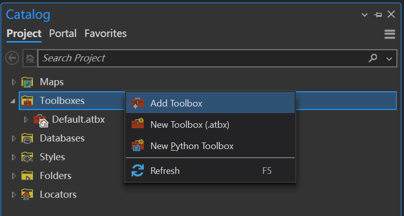
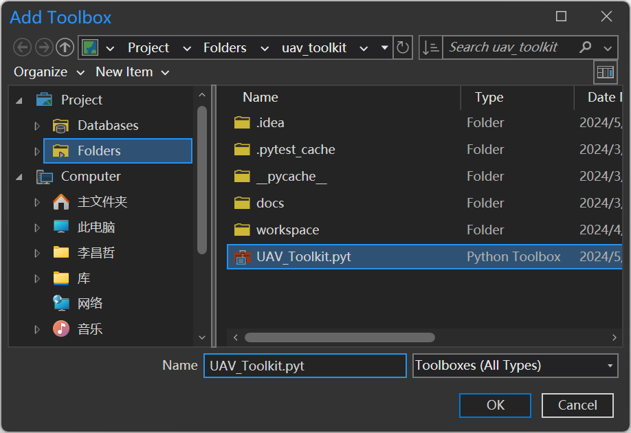

# 安装和配置

## 配置要求

| 配置项        | 版本要求    | 描述                |
|------------|---------|-------------------|
| git        | \>=2.0  | 版本控制工具            |
| ArcGIS Pro | \>=3.0  | 基础GIS软件，带有Conda环境 |
| CUDA (可选)  | \>=11.0 | GPU加速计算           |

## 搭建Python环境

1. 克隆一个`arcgispro-py3`的环境[<sup>[1]</sup>](#R1)，并激活该环境。
2. 安装必要的Python库：
    先安装`numpy`和`opencv`库：

    ```bash
    conda activate <your_env>
    conda install -c conda-forge numpy opencv
    ```
    如果您的计算机支持CUDA，那么这里推荐安装支持CUDA的PyTorch，以提高训练速度。在安装PyTorch时，需要安装指定CUDA Toolkit的版本[<sup>[2]</sup>](#R2)[<sup>[3]</sup>](#R3)。

    ```bash
    conda install -c pytorch pytorch torchvision cudatoolkit=<your_cuda_version>
    ```
   
    如果您的计算机不支持CUDA，那么可以安装不支持CUDA的PyTorch。

    ```bash
    conda install -c pytorch pytorch torchvision torchaudio cpuonly
    ```
   
    安装Segment Anything的Python库：

    ```bash
    pip install git+https://github.com/facebookresearch/segment-anything.git
    ```

## 安装工具包

1. 从[GitHub Releases | Jaffe2718/uav_toolkit](https://github.com/Jaffe2718/uav_toolkit/releases)下载最新的工具包，解压到项目工作目录即可。

2. 在ArcGIS Pro的`Catalog`界面中，右击`Toolboxes`，选择`Add Toolbox`，选择解压后的工具包中的`uav_toolkit.tbx`文件，点击`添加`。
    <br>
    

## 参考文献

<a name="R1" href="https://pro.arcgis.com/en/pro-app/latest/arcpy/get-started/installing-arcpy.htm">[1]</a> Install ArcPy—ArcGIS Pro | Documentation. (n.d.). Pro.arcgis.com. Retrieved May 16, 2024

<a name="R2" href="https://pytorch.org/get-started/locally/">[2]</a> NVIDIA. (2013, July 2). CUDA Toolkit. NVIDIA Developer.

<a name="R3" href="https://pytorch.org/get-started/locally/">[3]</a> PyTorch. (n.d.). www.pytorch.org.

