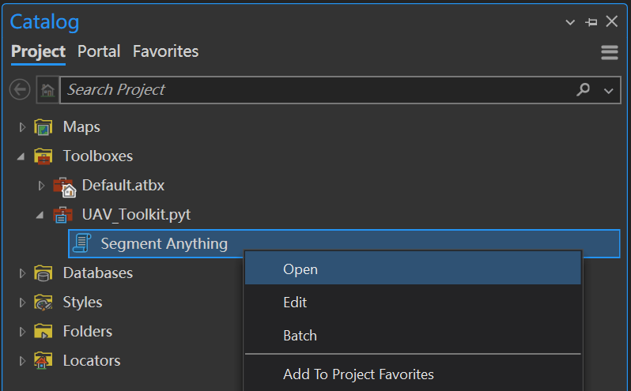
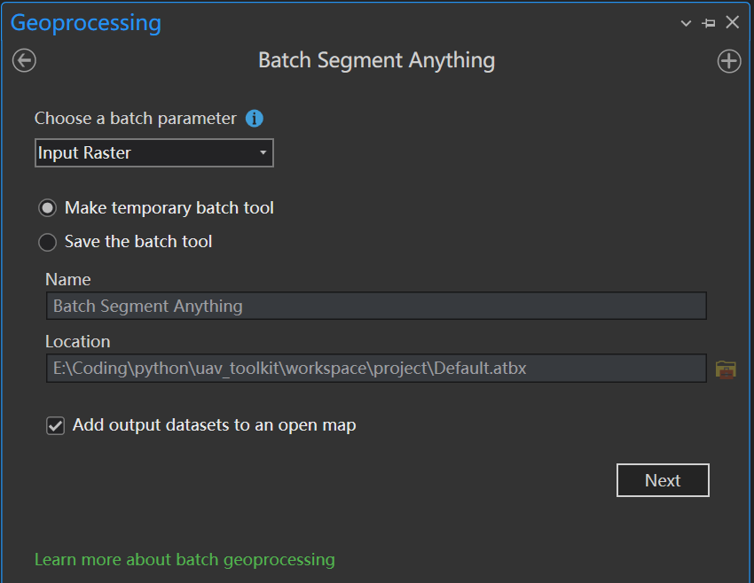

# 使用说明

> 使用此工具前务必完成[配置和安装](./setup.md)步骤。
> 参数的具体说明请参考[调参指南](./params.md)。

## 1. 交互式
1. 在ArcGIS Pro中打开`Catalog`面板，在`Toolboxes`中找到`UAV_Toolkit` > `Segment Anything`工具箱，右击`Segment Anything`工具箱，选择`Open`。
    
2. 配置工具参数，点击`Run`按钮运行工具。

## 2. 批处理
1. 在ArcGIS Pro中打开`Catalog`面板，在`Toolboxes`中找到`UAV_Toolkit` > `Segment Anything`工具箱，右击`Segment Anything`工具箱，选择`Batch`。并且`Choose a batch parameter`选择`input_raster`，表示批处理的输入栅格。
    
2. 配置工具参数，点击`Run`按钮运行工具。可以在输出的要素类里面使用`%Name%`来表示批处理的输入栅格的名称。


## 3. 代码调用

```python
import arcpy

# load toolbox
uav_toolkit = arcpy.ImportToolbox('path/to/UAV_Toolkit.pyt')   # load toolbox

'''
uav_toolkit.SegmentAnything(<model_checkpoint_path: str>,
                            <model_checkpoint_type: str>,
                            <input_raster: str>,
                            <red_channel: str>,
                            <green_channel: str>,
                            <blue_channel: str>,
                            <points_per_side: int>,
                            <points_per_batch: int>,
                            <pred_iou_thresh: float>,
                            <stability_score_thresh: float>,
                            <stability_score_offset: float>,
                            <box_nms_thresh: float>,
                            <crop_n_layers: int>,
                            <crop_nms_thresh: float>,
                            <crop_overlap_ratio: float>,
                            <crop_n_points_downscale_factor: int>,
                            <min_mask_region_area: int>,
                            <output_feature_class: str>,
                            <use_gpu: bool>
)
'''


uav_toolkit.SegmentAnything("path/to/sam_vit_h_4b8939.pth", "vit_h", "path/to/original/raster.tif", "Band_3", "Band_2", "Band_1", 64, 6, 0.88, 0.95, 1, 0.7, 0, 0.7, 512/1500, 2, 10, "path/to/the/result_vit_h.shp", True)

uav_toolkit.SegmentAnything("path/to/sam_vit_l_0b3195.pth", "vit_l", "path/to/original/raster.tif", "Band_3", "Band_2", "Band_1", 64, 6, 0.88, 0.95, 1, 0.7, 0, 0.7, 512/1500, 2, 10, "path/to/the/result_vit_l.shp", True)

uav_toolkit.SegmentAnything("path/to/sam_vit_b_01ec64.pth", "vit_b", "path/to/original/raster.tif", "Band_3", "Band_2", "Band_1", 64, 6, 0.88, 0.95, 1, 0.7, 0, 0.7, 512/1500, 2, 10, "path/to/the/result_vit_b.shp", True)
```